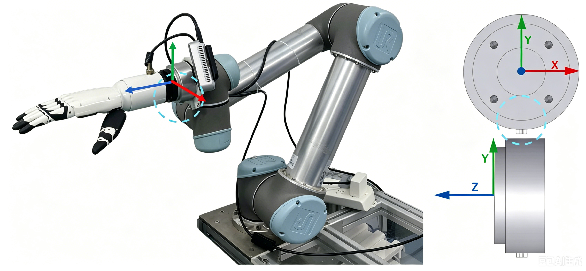

# tele_UR

This codebase is primarily used for demonstration data collection and also serves as the foundation for human-in-the-loop data collection, so please configure it first. The main entry point is `servoL.py`: it uses an OpenVR tracker to control the UR5 TCP pose, maps MANUS glove data to Inspire hand commands, records RealSense images, and saves each demonstration as an HDF5 file.

## 1. Install the `tele` Conda Environment

Python 3.8 is recommended. The existing `tele` environment on this machine uses Python 3.8.20, and the commands below use the dependency versions verified in that environment.

```bash
conda create -n tele python=3.8 -y
conda activate tele

python -m pip install --upgrade pip
python -m pip install \
  numpy==1.23.5 \
  opencv-python==4.6.0.66 \
  pyrealsense2==2.55.1.6486 \
  ur-rtde==1.6.2 \
  openvr==2.5.102 \
  h5py==3.11.0 \
  zarr==2.16.1 \
  pynput==1.8.1 \
  pyserial==3.5 \
  termcolor==2.4.0 \
  tqdm==4.62.3 \
  imageio==2.35.1
```

After installation, run a basic import check:

```bash
conda activate tele

python - <<'PY'
import numpy, cv2, pyrealsense2, rtde_control, rtde_receive
import openvr, h5py, zarr, serial, termcolor, tqdm, imageio
print("tele core imports ok")
PY
```

`pynput` needs access to the local desktop/X session. It may fail over SSH or in a headless session. Before collection, check it separately:

```bash
python - <<'PY'
from pynput import keyboard
print("pynput ok")
PY
```

## 2. Hardware and System Setup

### Hardware Setup



As shown above, install the Inspire dexterous hand so that its palm normal points along the negative y-axis.

Before collecting data, make sure the following hardware and services are ready:

- UR5 robot: the code connects to `192.168.3.6` by default. Configure this in the `UR_HOST` constant in `servoL.py` and `traj_valid.py`. If jitter is severe, reduce speed to 50%.
- UR controller: Connect the computer to the robot controller with an Ethernet cable, either directly or through a LAN switch. Configure both devices on the same IP subnet, and enable Remote Control/RTDE on the robot.
- Inspire hand: default serial port is `/dev/ttyUSB0`, baud rate `115200`.
- RealSense cameras: First install the [Intel RealSense SDK (librealsense)](https://github.com/IntelRealSense/librealsense/blob/master/doc/distribution_linux.md), including its udev rules. Then connect the two cameras; the code uses `front_cam_idx=0` and `right_cam_idx=1` by default, with device serial numbers sorted before indexing.
- SteamVR: Set up the Vive Tracker following [Software Setup Tutorial - VIVE Tracker setup](https://docs.google.com/document/d/1ANxSA_PctkqFf3xqAkyktgBgDWEbrFK7b1OnJe54ltw/edit?tab=t.0#heading=h.yxlxo67jgfyx).
- MANUS glove: First follow the [ManusTele repository](https://github.com/siiuuuuuu/ManusTele) to configure and start the MANUS client. Then connect the client to `localhost:8888`, where `SM_inspire_manus_process.py` listens by default, and stream the glove data.

Set temporary serial permission:

```bash
sudo chmod 666 /dev/ttyUSB0
```

If RealSense devices cannot be enumerated, install librealsense/udev rules first, then reconnect the cameras.

## 4. Collect Demonstrations

After the UR robot, RealSense cameras, SteamVR, MANUS client, and Inspire hand are ready, run:

```bash
conda activate tele
```

Edit the robot address, workspace limits, initial pose, output directory, hand serial port, and other collection settings at the top of `collect_data.sh`. Then run:

```bash
bash collect_data.sh
```

Keyboard controls:

- Before pressing `s`, align your right hand with the robot end-effector orientation for more intuitive teleoperation.
- Press `s`: start recording the current episode.
- Press `s` again: stop recording the current episode.
- After recording stops, the terminal asks whether to save the data. Enter `y` to save or `n` to discard.
- Press `a`: stop the whole collection loop.

Saved file names use this format:

```text
demo_YYYYMMDD_HHMMSS.h5
```

HDF5 fields:

- `color`: front camera RGB image, default shape `[T, 256, 256, 3]`.
- `wrist_color`: wrist camera RGB image, present when `use_wrist_img` is enabled.
- `env_qpos_proprioception`: robot state, `[6 joint + 6 TCP pose]`, shape `[T, 12]`.
- `action`: action vector, `[absolute target xyz + 6D rotation + 6 hand]`, shape `[T, 15]`.

## 5. Convert HDF5 to Zarr

For regular teleoperation data, edit the input directory, output directory, and saved observation types at the top of `convert_data.sh`. Then run:

```bash
bash convert_data.sh
```

For data with `success` / `intervention` metadata, or when merging multiple directories, edit the directory list and output settings at the top of `convert_rollout_data.sh`. Then run:

```bash
bash convert_rollout_data.sh
```

Note: the conversion scripts overwrite `save_dir` if it already exists.

## 6. Inspect Data and Replay Trajectories

Play the `color` and `wrist_color` camera streams:

```bash
python read.py ~/dp_data/new_task1_expertdata
```

Play rollout data with cameras and `intervention` / `success` status overlays:

```bash
python read_with_intervention.py ~/dp_data/offlineRL_data/new_task1_iter1
```

`read.py` displays both cameras side by side with playback status, frame information, and a progress bar. `read_with_intervention.py` additionally uses green borders for autonomous steps and red borders for intervention steps, displays the current mode and episode success/failure at the top, and shows all intervention segments on the bottom timeline.

Both scripts accept either an individual HDF5 file or a directory. Use `--fps` to change the playback frame rate and `--pattern` to change the file glob used for a directory:

```bash
python read.py ~/dp_data/new_task1_expertdata/demo_YYYYMMDD_HHMMSS.h5 --fps 25
python read_with_intervention.py ~/dp_data/offlineRL_data/new_task1_iter1 --pattern 'demo_*.h5'
```

Playback controls:

- `Space`: pause or resume.
- `f` / `b`: move forward or backward by 10 frames.
- `r`: restart the current file.
- `n`: play the next file.
- `q`: quit playback.

After reviewing an episode, correct an incorrect `success` attribute by passing the HDF5 file's absolute path and the correct value:

```bash
# Mark one episode as failed
python fix_h5_success.py /home/lrz/dp_data/offlineRL_data/task1/demo_20260507_114630.h5 false

# Mark one episode as successful
python fix_h5_success.py /home/lrz/dp_data/offlineRL_data/task1/demo_20260507_114630.h5 true
```

To replay one trajectory on the UR robot and Inspire hand, edit the trajectory path and hardware settings at the top of `replay_trajectory.sh`. Keep them consistent with the settings used during collection, then run:

```bash
bash replay_trajectory.sh
```

Replay sends real commands to the robot and hand and asks for confirmation before starting. Verify the workspace, emergency stop, initial pose, and surrounding environment. The script rejects trajectories whose first recorded target exceeds the configured `max_initial_distance`.

## BibTeX

Please consider citing our work if you find this repository useful:

```bibtex
@article{liao2026dexpie,
  title         = {{DexPIE}: Stable Dexterous Policy Improvement from Real-World Experience},
  author        = {Liao, Ruizhe and Chen, Wenrui and Zeng, Liangji and Lin, Haoran and Yang, Fan and Yang, Kailun and Wang, Yaonan},
  journal       = {arXiv preprint arXiv:2606.09615},
  year          = {2026},
  doi           = {10.48550/arXiv.2606.09615},
  url           = {https://arxiv.org/abs/2606.09615},
  eprint        = {2606.09615},
  archivePrefix = {arXiv},
  primaryClass  = {cs.RO}
}
```

## Acknowledgement

We thank the authors of [iDP3 / Humanoid-Teleoperation](https://github.com/YanjieZe/Humanoid-Teleoperation) for their open-source work, which provided valuable reference and inspiration for this project.
